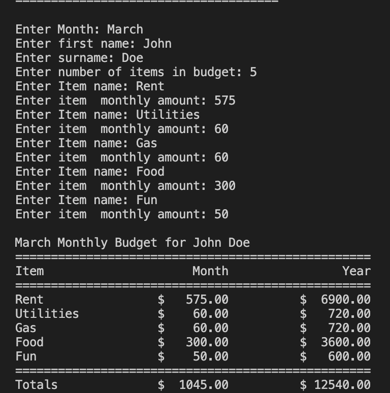

# monthly-budget

## Description 
This program prompts the user for his/her monthly expenses and displays a report 
estimating the total monthly and yearly expenses 
 
This program uses the terminal to prompt the user and display the report 
 

## Program Sample 

## Program Set Up
This program used Python3 </b>
Please go to https://www.python.org/downloads/
to install the latest version of Python
 
 
Also, this program requires interface to run python and display the prompts in a terminal. 
 
 
You can install VS Code or Thony to satisfy this requirement. 
 
VS Code download link: https://code.visualstudio.com/
 
Thony download link: https://thonny.org/
 
 
To use the computer terminal, change to the directory where this project is stored and then type python3 Budget.py in the terminal 

